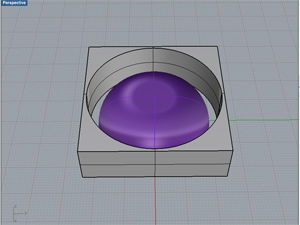
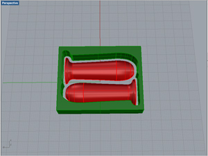

# 01.データ設定
  

## ★データ作成に使用するソフトウェアの例
 

**3Dデータ**

* **Rhinoceros （有料）：** [http://www.rhino3d.co.jp/](http://www.rhino3d.co.jp/)  
* **Autodesk FUSION360（無料）：** [http://www.autodesk.co.jp/products/fusion-360/overview](http://www.autodesk.co.jp/products/fusion-360/overview)

 
 

## ★データ形式
 

**.stl（3Dデータ）** （3D形状の削り出しを行うため、3Dデータが必須です。）

 
 

## ★必要なデータ

**加工データサイズ：** 最大203.2mm(X) × 152.4mm(Y) × 60.5mm(Z) 
（実際に制作したいサイズでデータを作成してください。） 
 
**ラフカット（荒削り加工）には直径約3mm**のフラットエンドミル、 
**フィニッシュカット（仕上げ加工）には直径約3mm**のボールエンドミルを使用するため、 
溝などを切削したい場合には、幅を3.2mm以上設けるようにしてください。 
また切断加工を行いたい場合は、以下のデータのように材料と造形物との間に3.2mm以上の隙間を設けてください。 
 

  
 
 
 
 
 
 
