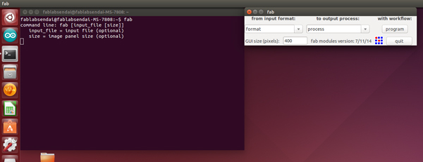
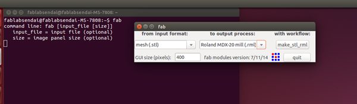
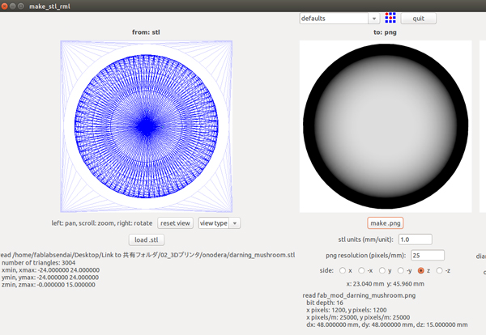
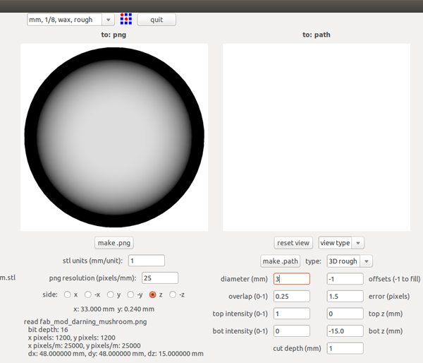

# 02.ソフトウェアセットアップ
  

 
 

ubuntuの左側メニューアイコンから**ターミナル（Terminal）**を開き、**"fab"**と入力してEnterキーを押します。 
そうすると**「Fabmodule」**というソフトが起動します。 
 
 
 

 
 

* **from input format:** Meshs(.stl)
* **to output process:** Roland MDX-20 mill(.rml)

上記のように設定したら**「make_stl_rml」**ボタンをクリックします。 
 
 
 

 

ウィンドウ左側の**「load.stl」**をクリックし、 
加工したいstlデータを選択して**「Open」**ボタンをクリックします。 
加工したいデータのサイズに間違いがないか確認したら、**「make.png」**をクリックします。 
 
 
 

 
 

ウィンドウ上部のプルダウンメニューから**"mm, 1/8, wax, rough"**を選択します。 
更に、ウィンドウ下部の各種設定欄に任意の数値を入力します。 
（使用する材料によって、数値は変える必要があります。） 
 

**左側** 

* **stl units(mm/unit)：**STLファイルの単位（mmの場合は"1"）
* **png resolution(pixcels/mm)：**PNGの解像度。基本的にいじらない。
* **side：**STLファイルのどの面を削るのか。基本的にいじらない。

 

**右側** 

* **type：** 削り方の設定。まずはラフカットを行うので、ここでは"3D rough"を選択します。
* **diameter(mm)：**使用するエンドミルの刃の直径。
* **overlab(0-1)：**ツールパスをどれくらい重ねるか。 
1に近づくほど、時間はかかるが滑らかな仕上がりになります。
* **top intensity(0-1)：**不明。いじらなくてOK。
* **bot intensity(0-1)：**不明。いじらなくてOK。
* **offsets(-1 to fill)：**3D切削の場合は"-1"に設定します。
* **error(pixels)：**不明。いじらなくてOK。
* **top z(mm)：**切削範囲の上限高さ。
* **bot z(mm)：**切削範囲の下限高さ。
* **cut depth(mm)：**各階層の削る厚さ。薄いほど切削時間は増えますが、マシンへの負荷が減ります。

 
すべての設定が完了したら**「make.path」**ボタンをクリックします。 
そうすると、実際の加工パス（エンドミルの動くライン）が表示されます。 
 
 
 
 
 
 
