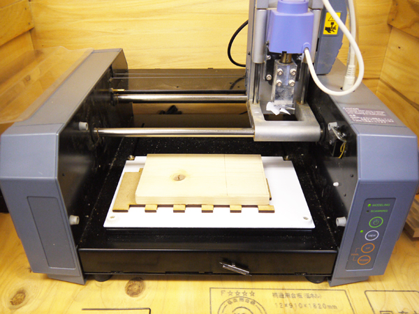

# 03.マシンのセットアップ
  

  
 

マシンの手前2箇所にあるネジを緩め、テーブルを取り外します。 
 
 
 

 
 
   
 

もし上記のようにテーブルが汚れていたら、ソルベント等で拭き取り掃除をします。 
 
 
 

 
 

加工用材料と捨て板、両面テープを用意します。捨て板はMDF等の板材でかまいません 
 
 
 

 
 

加工用材料に両面テープで捨て板を貼り付け、更にそれを両面テープでテーブルに貼り付けます。 
 
 
 

 
 

テーブルをマシンに戻します。このとき、始めに取り外したネジでしっかりと固定してください。 
 
 
 

   
 

マシン右側の**緑色の電源ボタン**を押してマシンを起動し、**「VIEW」ボタン**を押します。 
（「VIEW」ボタンのライトが点灯していると、パソコンからのデータ転送を行うことができません。） 
 
 
 

 
 

加工原点を設定します。（加工原点はデータの左下／左手前となります。） 
ソフトウェア右側にある **"xmin(mm)"** と **"ymin(mm)"** に任意の数値を入力し、 
**「move to xmin,ymin」**ボタンをクリックします。 
そうすると、マシンのヘッド（エンドミルが付いた部分）が指定位置に移動します。 
 
 
 

 
 

エンドミルの取り付けを行います。 
今回は、**ラフカット（荒削り加工）には直径約3mm**のフラットエンドミルを使用します。 
 
 
 

  
 

ヘッドに、下からエンドミルを差し込みます。 
エンドミルを手で抑えたまま、六角レンチでエンドミル取り付け部横のネジを締めます。 
（小さい穴があいているので、そこに六角レンチを差し込みます。） 
 
 
 

 
 

エンドミルはできるだけ奥に差し込んでおきます。 
 
 
 

  
 

エンドミルを固定したら、マシン右側の**「Down」ボタン**を押してヘッドを下げます。 
このとき、ヘッド上部の隙間が10mm程度になるくらいのところまで下げましょう。 
 
 
 

   
 

指をエンドミルに添えて、エンドミル取り付け部横のネジをゆるめます。 
そのままゆっくりエンドミルの先端を素材の上面まで下げ、再度ネジを締めます。 
指を急に離すとエンドミルが落下し、先端が折れてしまうので、注意して作業を行ってください。 
 
 
 
 
 
 
