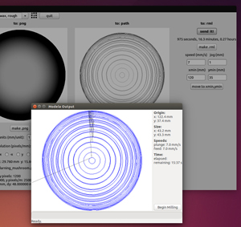
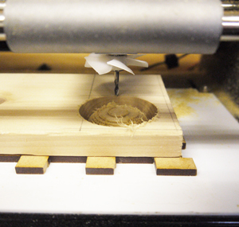

# 04.データ送信〜ラフカット
  

 
 

speed(mm/s)をjog(mm)任意の数値に設定したら**「make.rml」**をクリックします。 
（ここではヒバの板材を使用しているので、speedを7、jogを1に設定しています。） 
更に **「send it!」**  をクリックしてマシンへデータを転送し**「Begin Milling」**をクリックして加工を開始します。 
 
 
 

 
 

加工が完了したら **「Exit」**をクリックます。 
これでラフカット（荒削り加工）は完了です。 
 
 
 
 
 
 
