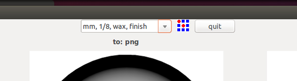
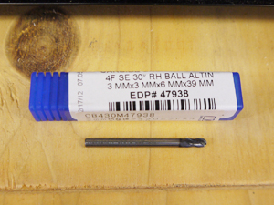
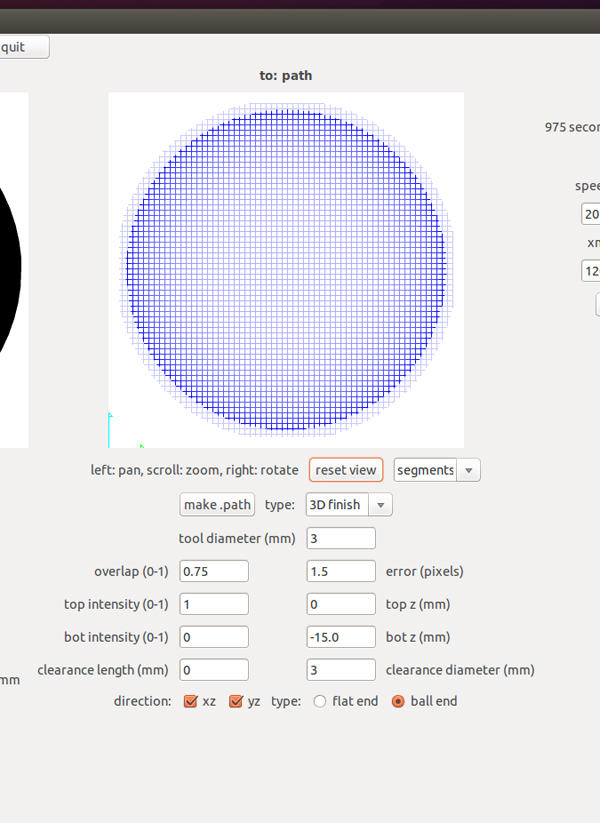
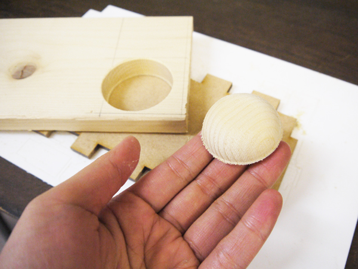

# 05.データ送信〜フィニッシュカット
  

 
 

ウィンドウ上部のプルダウンメニューから**"mm, 1/8, wax, finish"**を選択してください。 
 
 
 

 
 

更に、[03.マシンのセットアップ](/03-machine-setup.md)の手順を参考にして、 
**直径3.0mm**のボールエンドミルに取り替えます。 
 
 
 

 
 

ウィンドウ下部の各種設定欄に任意の数値を入力します。 
（使用する材料によって、数値は変える必要があります。） 
今回はフィニッシュカットを行うので、typeは必ず**"3D finish"**を選択します。
 

* **type：** 削り方の設定。今回はフィニッシュカットを行うので、ここでは"3D finish"を選択します。
* **tool diameter(mm)：**使用するエンドミルの刃の直径。
* **overlab(0-1)：**ツールパスをどれくらい重ねるか。 
1に近づくほど、時間はかかるが滑らかな仕上がりになります。
* **top intensity(0-1)：**不明。いじらなくてOK。
* **clearance length(mm)：**基本的に"0"でOK。シャンクと刃の径が違う場合は、刃の長さを入力します。
* **offsets(-1 to fill)：**3D切削の場合は"-1"に設定します。
* **error(pixels)：**不明。いじらなくてOK。
* **top z(mm)：**切削範囲の上限高さ。
* **bot z(mm)：**切削範囲の下限高さ。
* **clearance diameter(mm)：**基本的に"0"でOK。シャンクと刃の径が違う場合は、シャンクの長さを入力します。
* **direction：**仕上げ加工の方向を入力します。XZは横方向、YZは縦方向に削ります。 
両方にチェックマークを付けると、縦横どちらも削ります。ビットの形状によってBallかFlatにチェックをつけます。

 
 
 

 
 

加工中にエンドミルが折れてしまうこともあるので、加工を開始したら完全に放置するのではなく 
時々様子を確認するようにしましょう。 
加工が完了したら**「Exit」**ボタンを押します。 
ボードをマシンから取り外し、ヘラなどを使用して素材を剥がしましょう。
 
 
 
 
 
 
