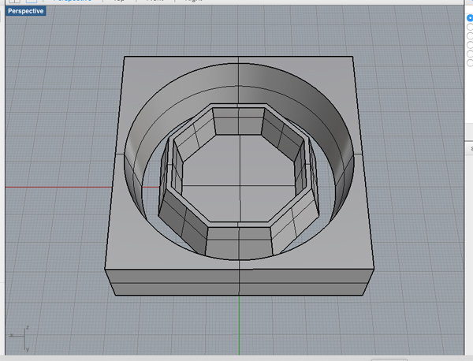
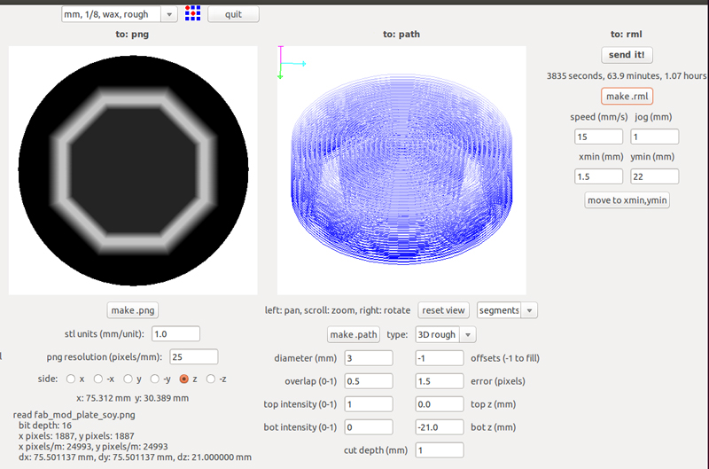
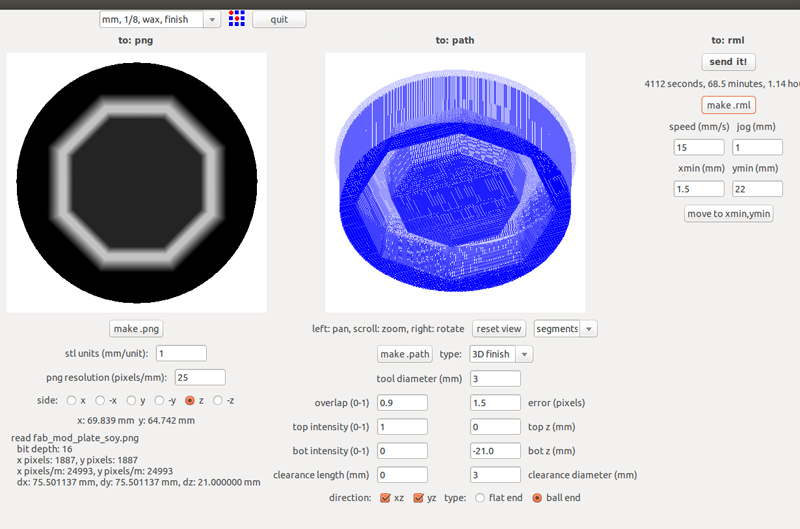
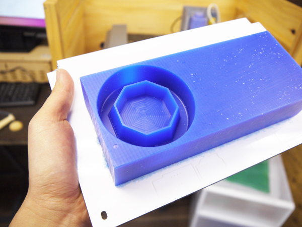
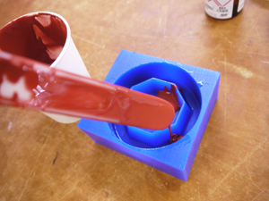
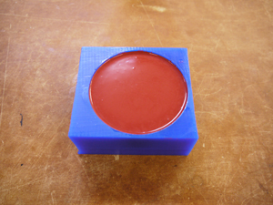
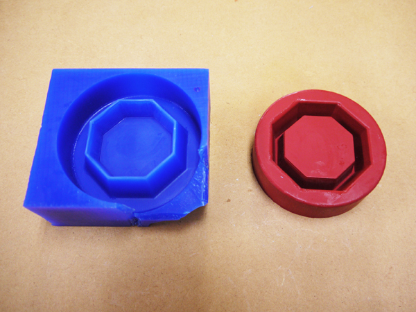
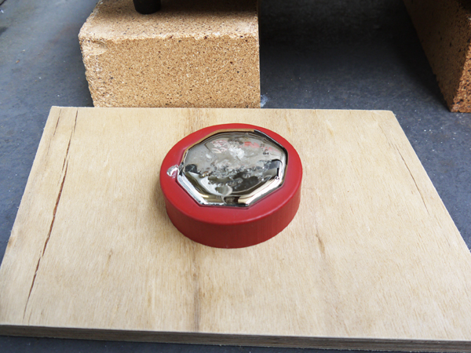
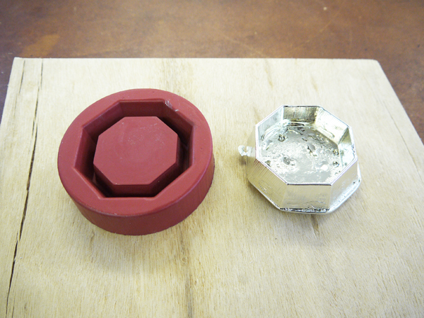

# 06.加工サンプル（モデリングワックスを使った原型制作〜鋳造加工）
  

モデリングワックスは、アクセサリーの原型づくりや、シリコーン造形の原型づくりなどに使用される材料です。 
 
 

 
 

3Dモデリングソフトウェア「Rhinoceros」で上記のようなモデルを制作し、stlデータで書き出しします。 
 
 
 

 
 

ラフカット（荒削り加工）時の設定はこちら 
 
 
 

 
 

フィニッシュカット（仕上げ加工）時の設定はこちら 
 
 
 

 
 

完成した原型がこちら。材料をプレートに直接両面テープで固定しています 
また、今回はここにシリコーンを流してしようするため、切断加工は行っていません。 
3Dデータの外壁を、材料本体の厚さより低く設計することで、このように底面を残した切削を行うことができます。 
 
 
 

  
 

ここに耐熱性シリコーンを流し込み硬化させます。 
 
 
 

 
 

モデリングワックス製の型（左）から取り外したシリコーン型（右）がこちら。 
 
 
 

 
 

更に、シリコーン型へ溶かした錫（すず）を流し込みます。 
 
 
 

 
 

このように、始めに作成した3Dモデルと同形状の錫の造形物ができあがりました。 
 
 
 
 
 
 
