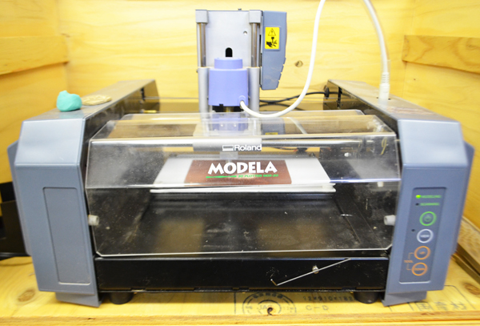

# 00.Introduction
  

 
 

[Roland MODELA MDX-20](https://www.rolanddg.com/ja/news/2000/001030-modela-mdx-20)の使用マニュアルです。  
 
MODELAは、任意のデータ形状をブロック状の素材から削り出すことのできるマシンです。 
回転するドリルを移動させながら、素材を削るので3Dプリンタよりも材質の選択肢が広がり、 
設定次第ではより滑らかな仕上がりにすることも可能です。 
 
ここでは、stlデータ（3Dデータ）を用いた、木材等の切削方法を説明します。 
 
FabLab SENDAI - FLATでの使用方法をベースにまとめられた内容なので、 
同機種でも使用方法が異なる場合があります。あらかじめご注意ください。 
 
 

## ★加工可能な素材について
 

* **サイズ：** 203.2mm(X) × 152.4mm(Y) × 60.5mm(Z)
* **テーブルサイズ：** 220mm(X) × 160mm(Y)
* **加工可能素材例：**  
◎ 木材、紙フェノール基板材料（=ベーク基板）、樹脂 (モデリングワックス、発泡材など)、ケミカルウッド、石膏 
△ 真鍮、アルミ(JISのA5052)（←加工に大変時間がかかるため、おすすめはしていません）
 
 
 
 
 
 
